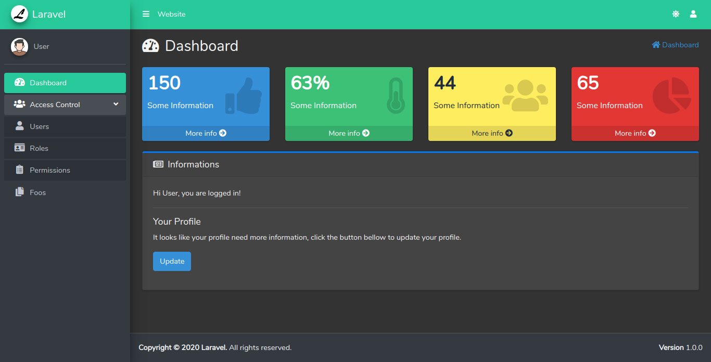

# Boilerplate Laravel 8.0 + Vue.js + AdminLTE 3.0.4 
A blank project with all you need to start a new application using Laravel and AdminLTE.

Use the file config/template.php to customize menu, color, version, etc.

### Features
- [X] Vue.js
- [X] Laravel Passport (API)
- [x] Basic Bootstrap Template (Site)
- [x] AdminLTE Template (Admin)
- [x] Basic Dark Mode (Admin)
- [x] Form Components Ready to Use
- [X] Multi-language Support (including Vue.js components)
- [x] User Authentication
- [X] User Profile (Basic)
- [X] Access Control List (Basic ACL)
- [X] CURD to manage Users
- [X] CURD to manage Roles and Permissions
- [X] Basic CRUD Example
- [X] Social Login

### Site Preview


### Admin Preview




### Instalation
Assuming you already have the database service running, make a copy or rename ".env.example" file to ".env" and configure some variables before.

```
composer install
php artisan key:generate
```

If you want a basic example ACL run:
```
php artisan migrate --seed
```
In this case, after creating your user, you may want to remove "Super User" as default role for new users on "/admin/roles".

If you want a clean database run:
```
php artisan migrate
```

If you want to use Laravel Passport, execute this command to generate the encryption keys...
```
php artisan passport:install
```
...and enable the default routes in .env file by change this property to true.
```
ENABLE_API=true
```

You may want to link the storage folder with public folder.
```
php artisan storage:link
```

To compile Vue
```
npm install
npm run watch
```


### Run
```
php artisan serve
```

### CRUD
Here we have the steps to create a new simple CRUD, here we are going to create a CRUD of Books.

1- Create a model with migrations and controller (inside Admin/)
```
php artisan make:model Book --migration
php artisan make:controller Admin/BookController
```

2- In Book model, Add "use SoftDeletes", the fillable fields, and User relationship.
```php
namespace App;

use Illuminate\Database\Eloquent\Model;
use Illuminate\Database\Eloquent\SoftDeletes;

class Book extends Model
{
  use SoftDeletes;  
  protected $fillable = ['title', 'pages', 'user_id'];
  
  public function user()
  {
    return $this->belongsTo('App\User');
  }
}
```

3- Include the fields in the created migrations in method up(), it should looks like this
```php
Schema::create('books', function (Blueprint $table) {
  $table->id();
  $table->unsignedBigInteger('user_id');
  $table->foreign('user_id')->references('id')->on('users')->onDelete('cascade');
  $table->string('title');
  $table->integer('pages');
  $table->timestamps();
  $table->softDeletes();
});
```

4- Update the database with the new entity
```
php artisan migrate
```

5- Add resource route to Books in "/app/routes/web.php"
```php
Route::resource('books', 'BookController');
```

6- Copy the folder "/resources/views/admin/foos" to "/resources/views/admin/books"

7- In BookController, extends from CrudController class and make some configurations
```php
namespace App\Http\Controllers\Admin;

use App\Http\Controllers\CrudController;
use Illuminate\Http\Request;

class BookController extends CrudController
{
  protected $model = \App\Book::class;
  protected $onlyMine = true;
  
  protected $rules = [
    'title' => 'required|min:3',
    'pages' => 'required|integer|min:1',
  ];
  
  function __construct()
  {
    $this->names = [
      'title' => trans('crud.title'),
      'pages' => trans('crud.pages'),
    ];

    $this->icon = 'book';
    $this->label = trans('crud.book');
    $this->title = trans('crud.books');
  }
}
```

8- Include the Book menu into "/config/template.php"
```php
['name' => 'Books', 'icon' => 'book', 'action' => 'admin:books.index', 'permission' => 'books-view'],
```

9- Finally add the new field "pages" in the 3 views.

/resources/views/admin/books/list.blade.php
```html
@extends('admin.layouts.template-resource-list')

@section('thead')
    <tr>
        <th>@lang('crud.id')</th>
        <th>@lang('crud.title')</th>
        <th>@lang('crud.pages')</th>
        <th>@lang('crud.author')</th>
        <th class="text-center">@lang('crud.actions')</th>
    </tr>
@endsection

@section('tbody')
    @foreach($items as $item)
        <tr>
            <td class="align-middle">{{ $item->id }}</td>
            <td class="align-middle">
                <a href="{{ route('admin:'.$resource.'.edit', $item->id) }}" title="@lang('crud.edit')">
                    <b>{{ $item->title }}</b>
                </a>
            </td>
            <td class="align-middle">{{ $item->pages }}</td>
            <td class="align-middle">{{ $item->user->short_name }}</td>
            <td class="align-middle text-center text-nowrap">
                @include('admin.layouts.partials.actions', [
                    'resource' => $resource,
                    'id' => $item->id,
                    'name' => $item->title
                ])
            </td>
        </tr>
    @endforeach
@endsection
```

/resources/views/admin/books/show.blade.php
```html
@extends('admin.layouts.template-resource-show')

@section('fields')
    <div class="form-group row">
        <label class="col-2 text-right">@lang('crud.title')</label>
        <div class="col">{{ $item->title }}</div>
    </div>
    <div class="form-group row">
        <label class="col-2 text-right">@lang('crud.pages')</label>
        <div class="col">{{ $item->pages }}</div>
    </div>
    <div class="form-group row">
        <label class="col-2 text-right">@lang('crud.author')</label>
        <div class="col">{{ $item->user->short_name }}</div>
    </div>
    <div class="form-group row">
        <label class="col-2 text-right">@lang('crud.created-at')</label>
        <div class="col">{{ $item->created_at->format('d/m/Y H:i:s') }}</div>
    </div>
    <div class="form-group row">
        <label class="col-2 text-right">@lang('crud.updated-at')</label>
        <div class="col">{{ $item->updated_at->format('d/m/Y H:i:s') }}</div>
    </div>
@endsection
```

/resources/views/admin/books/form.blade.php
```html
@extends('admin.layouts.template-resource-form')

@section('fields')

    {{ Form::input([
        'ref' => 'title',
        'label' => 'crud.title',
        'required' => true,
        'icon' => $icon,
        'value' => !empty(old('item.title')) ? old('item.title') : ( isset($item) ? $item->title : '' ),
    ]) }}

    {{ Form::input([
        'ref' => 'pages',
        'label' => 'crud.pages',
        'required' => true,
        'icon' => $icon,
        'value' => !empty(old('item.pages')) ? old('item.pages') : ( isset($item) ? $item->pages : '' ),
    ]) }}

@endsection
```
